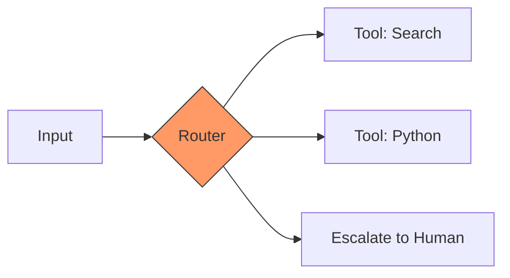

# Модуль 3: Архитектура и Мышление Агентов
*(v2: Agentic Design Patterns Edition)*

---

## Структура модуля

+ **Блок 1**: Анатомия и классификация (Intro)
+ **Блок 2**: Базовые паттерны проектирования (Part 1)
+ **Блок 3**: Надежность и Инфраструктура (MCP, Memory, RAG)
+ **Блок 4**: Коллаборация и Будущее (Multi-Agent, a2a)

---

## Блок 1: Анатомия и Философия
### От промпта к системе

---

## Что делает ИИ «Агентом»?
**Цикл автономности:**

1. 🎯 **Mission**: Получение цели ("Организуй встречу")
2. 👁️ **Scan**: Восприятие (Чтение почты, календаря)
3. 🧠 **Think**: Планирование оптимального пути
4. ⚙️ **Act**: Действие (Отправка инвайтов)
5. 📈 **Learn**: Рефлексия и улучшение (Learning loop)

---

## Уровни сложности Агентов

<grid drag="100 80" drop="0 10">
+ Level 0: **Core Reasoning** (Чистая LLM, без инструментов)
+ Level 1: **Connected** (LLM + Tools + RAG)
+ Level 2: **Strategic** (Planning + Context Engineering)
+ Level 3: **Collaborative** (Команда специалистов / Multi-Agent)
</grid>

---

## Блок 2: Паттерны проектирования
### Азбука агентских систем (по А. Гулли)

---

## 1. Prompt Chaining
### Последовательность

+ **Проблема**: Монолитные промпты "глючат" на сложных задачах.
+ **Решение**: Разбиение на цепочку простых шагов.
+ **Суть**: Output шага A становится Input шага B.
+ Результат: Высокая надежность и легкая отладка.

---

## 2. Routing
### Принятие решений

+ Агент сам выбирает путь на основе классификации запроса.

---

## 3. Parallelization
### Скорость и Оптимизация

+ **Sectioning**: Разделение задачи на независимые части.
+ **Voting**: Запуск 3-х вариантов одновременно для выбора лучшего.
+ Эффект: Радикальное снижение задержки (latency).

---

## 4. Reflection
### Самопроверка (Generator-Critic)

<grid drag="45 60" drop="2 20" align="top" style="border: 2px solid #555; padding: 10px;">
**Producer**
Пишет код/текст
</grid>

<grid drag="45 60" drop="53 20" align="top" style="border: 2px solid orange; padding: 10px;">
**Critic**
Ищет ошибки и критикует
</grid>

+ Цикл повторяется, пока результат не станет идеальным.

---

## 5. Tool Use & Planning
### Руки и Карты

+ **Tool Use**: Стандартизация вызова внешних функций (API).
+ **Planning**: Прежде чем делать — напиши план.
+ **ReAct**: Постоянный цикл "Мысль -> Действие -> Наблюдение".

---

## Блок 3: Надежность и Инфраструктура
### Мозги и Память

---

## Memory Management
### Как агент «помнит»

+ **Short-term**: Текущий контекст диалога.
+ **Long-term**: Семантическая база (Vector DB).
+ **Entity Memory**: Память о фактах (кто вы, ваши предпочтения).

---

## Model Context Protocol (MCP)
### Единый штекер для данных

+ Индустриальный стандарт от Anthropic.
+ **Проблема**: Сотни приложений — сотни разных API.
+ **Решение**: Универсальный протокол общения Агента с миром.
+ Профит: Один сервер MCP работает с любым агентом.

---

## Exception Handling & HITL
### Когда всё идет не по плану

+ **Self-Correction**: Агент видит ошибку в терминале и сам ее исправляет.
+ **Human-in-the-Loop (HITL)**:
    - *Approval*: "Я готов купить билеты, подтверждаете?"
    - *Correction*: Человек правит логику агента на ходу.

---

## Блок 4: Коллаборация и Будущее
### Multi-Agent системы

---

## Multi-Agent Collaboration
### От одиночки к команде

+ **Orchestrator**: Раздает задачи.
+ **Workers**: Узкие специалисты (Coder, Researcher, QA).
+ **Synergy**: Групповое решение задач, непосильных одной модели.

---

## a2a: Agent-to-Agent
### Протоколы делегирования

+ Агенты заказывают услуги у других агентов.
+ Автономная передача контекста и состояния.
+ Формирование "цифровых департаментов".

---

## Guardrails & Evals
### Безопасность и Качество

+ **Guardrails**: Жесткие ограничения (не выполнять `rm -rf`, не хамить).
+ **Evals**: Автоматические тесты промптов.
+ **Benchmark**: Как понять, что версия v2 лучше чем v1?

---

## Что дальше?

+ **Блок 5**: Практика на n8n (Визуальное программирование паттернов).
+ **Блок 6**: Практика на Python/LangGraph (Код-реализация паттернов).

---

## Материалы

*   📖 [Agentic Design Patterns Book](https://github.com/sekachev/agentic-design-patterns-book-rus)
*   🛠️ Anthropic MCP SDK
*   🤖 LangGraph Documentation
