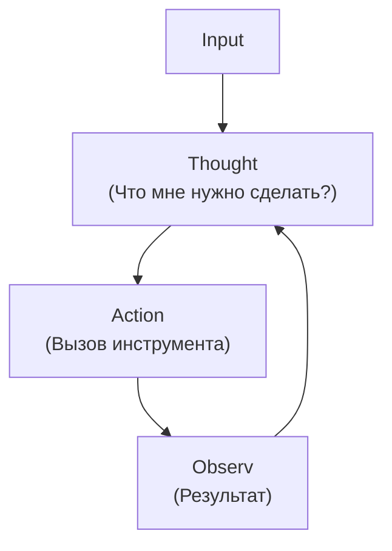

# Модуль 3: AI Агенты

---

## Структура модуля

+ Анатомия AI Агента
+ Паттерны проектирования
+ No-code (n8n)
+ Code (Dev)

---

## Блок 1: Анатомия AI Агента

---

## LLM - Большая языковая модель

```
                         ┌───────────┐
                         │           │      ┌────────┐
Ночь, улица, фонарь, ──▶ │    LLM    │ ──▶  │ аптека │
                         │           │      └────────┘
                         └───────────┘
```

---

### Проблемы "чистой" LLM

+ <span style="color:orange">Stateless</span>: ретроградная амнезия
+ <span style="color:orange">Контекст</span>: ограниченный
+ <span style="color:orange">Генерация</span>: объем и точность
+ <span style="color:orange">Инструменты</span>: нет "рук" для действий
+ <span style="color:orange">Знания</span>: только то, на чем обучалась
+ <span style="color:orange">Планирование</span>: трудности со сложными задачами

---

<grid drag="45 60" drop="2 15" align="top">
<i class="fas fa-cogs fa-3x"></i>
<br>

### LLM
+ <span style="color:orange">Текст</span> (Крутящий момент)
</grid>


<grid drag="45 60" drop="53 15" align="top">
<i class="fas fa-car fa-3x"></i>
<br>

### AI AGENT
+ <span style="color:orange">Управление</span> (Руль)
+ <span style="color:orange">Колеса</span> (Инструменты)
+ <span style="color:orange">Сенсоры</span> (Восприятие)
</grid>

---
### Agentic AI


  ```
  
Prompt  ──────▶  ACTIONS


		   PERCEIVE
		 (Восприятие)
		 ↗          ↘
	  LEARN        DECIDE
	(Обучение)    (Принятие решений)
		 ↖          ↙
		   EXECUTE
		 (Выполнение)


```


---

<grid drag="45 60" drop="2 15" align="top">
<i class="fas fa-cogs fa-3x"></i>
<br>

### LLM
+ <span style="color:orange">Текст</span> (Крутящий момент)
</grid>


<grid drag="45 60" drop="53 15" align="top">
<i class="fas fa-car fa-3x"></i>
<br>

### AI AGENT
+ <span style="color:orange">Управление</span> (Руль)
+ <span style="color:orange">Колеса</span> (Инструменты)
+ <span style="color:orange">Сенсоры</span> (Восприятие)
</grid>

---

### Веб-интерфейс -- "простейший агент"

      ___________________________________________
     | [X][-]  chatGPT.com                   [ ] |
     |-------------------------------------------|
     | Chat 1  |                                 |
     | Chat 2  |                                 |
     | Chat 3  |                                 |
     | Chat 4  |                                 |
     | Chat 5  |                                 |
     | Chat 6  |                                 |
     |         |                                 |
     |         |     [ Message...      ^ ]       |
     |_________|_________________________________|
---


### Что решает WebUI

+ <span style="color:orange">Память</span>: сохраняет историю переписки, знания о пользователе
+ <span style="color:orange">"Руки"</span>: дает доступ к базовым инструментам через UI
+ <span style="color:orange">Контекст</span>: автоматически управляет тем, что "видит" модель
+ <span style="color:orange">Универсальность</span>: системный запрос написан для широкого круга задач

---

### Что НЕ решает WebUI (или решает плохо)

+ <span style="color:orange">Автономность</span>: не может выполнять задачи без участия пользователя
+ <span style="color:orange">Контекст</span>: не может сам искать контекст пользователя
+ <span style="color:orange">Планирование</span>: не может сам разбить задачу на 10 шагов и выполнить их
+ <span style="color:orange">Рефлексия</span>: не умеет проверять результат своей работы
+ <span style="color:orange">Специализация</span>: универсальность мешает решать узкие экспертные задачи

---
### Кодинг-агенты (Antigravity)

+ <span style="color:orange">Динамический контекст</span>: видят весь проект целиком
+ <span style="color:orange">Прямое действие</span>: пишут код прямо в файлы проекта
+ <span style="color:orange">Инструменты</span>: имеют доступ к терминалу и браузеру
+ <span style="color:orange">Автономия</span>: могут запустить код и исправить свои ошибки
+ <span style="color:orange">Рефлексия</span>: могут проверять результат своей работы
+ <span style="color:orange">Скорость</span>: нет копипасте, diff editor
+ <span style="color:orange">Версионирование</span>: могут сохранять изменения в истории
+ <span style="color:orange">Универсальность</span>: решают разные задачи с кодом

---

### Ограничения текущих агентов

+ <span style="color:orange">Слабая специализация</span>: универсальность проигрывает узким экспертам
+ <span style="color:orange">Цена ошибки</span>: риск удаления данных при работе в терминале
+ <span style="color:orange">Человеческий контроль</span>: human in the loop
+ <span style="color:orange">Стоимость</span>: "просмотр" больших проектов тратит много токенов

---

## Блок 2: Паттерны проектирования
### Как заставить модель "думать"?

---

## Базовый цикл: ReAct

**Re**ason + **Act** (Подумал -> Сделал)

```    
       Input
         |
    .----v----.
    | Thought | <--- "Что мне нужно сделать?" <---.
    '----.----'                                    |
         |                                         |
    .----v----.                                    |
    | Action  | <--- Вызов инструмента             |
    '----.----'                                    |
         |                                         |
    .----v----.                                    |
    | Observ  | <--- Результат                     |
    '----.----'                                    |
         '-----------------------------------------'
```

---

## RAG: Retrieval Augmented Generation
База знаний агента

+ <span style="color:orange">Проблема</span>: Модель не знает ваших документов и "галлюцинирует" факты.
+ <span style="color:orange">Решение</span>: Retrieval Augmented Generation. Агент сначала ищет информацию в базе, а потом отвечает.
+ <span style="color:orange">Динамика</span>: Агент сам решает, когда ему нужно "заглянуть в книгу" (Tool Use).

---

## Model Context Protocol (MCP)

+ <span style="color:orange">Проблема</span>: Каждое приложение (Slack, GitHub, DB) имеет свой API. Нужно писать десятки коннекторов.
+ <span style="color:orange">Решение (MCP)</span>: Единый протокол от Anthropic для подключения ресурсов, промптов и инструментов.
+ <span style="color:orange">Универсальность</span>: Один раз настроил сервер MCP — его понимают все агентские системы (Claude Desktop, IDE, Custom Agents).

---

### Reverse engineering 

https://github.com/anomalyco/opencode
https://github.com/anomalyco/opencode/tree/dev/packages/opencode/src/session/prompt


---

## Обработка ошибок
### Exception Handling & Recovery

+ <span style="color:orange">Self-Correction</span>: "Я попробовал запустить код, получил ошибку ModuleNotFoundError. Значит, нужно установить библиотеку и попробовать снова".
+ <span style="color:orange">Retry Logic</span>: Умные повторы при сбоях API или таймаутах.
+ <span style="color:orange">Fallback</span>: Если сложная модель не справляется, переключаемся на более простую или просим помощи.

---

## Human-in-the-Loop (HITL)
### Человек как часть системы

+ <span style="color:orange">Approval</span>: Агент подготовил письмо или транзакцию, но ждет клика "Одобрить" от человека.
+ <span style="color:orange">Feedback</span>: Человек может поправить план агента на середине пути.
+ <span style="color:orange">Safety</span>: Критически важно для бизнес-процессов с реальными деньгами или данными.

---


---

## Блок 3: No-code подход (n8n)
### Быстрый старт

---

<grid drag="45 60" drop="2 20" align="top">

</grid>

<grid drag="45 60" drop="53 20" align="top">

</grid>

---

## n8n: За и Против
✅ PROS
+ <span style="color:orange">Визуальность</span>: сразу видно поток данных.
+ <span style="color:orange">Низкий порог входа</span>: быстрое освоение.
+ <span style="color:orange">JSON Schema</span>: LLM может сама написать сценарий
+ <span style="color:orange">Экосистема</span>: огромное количество шаблонов и активное комьюнити.


❌ CONS
+ <span style="color:orange">Ручной труд</span>: Очень много мелочей в настройках
+ <span style="color:orange">Versioning</span>: сложно отслеживать изменения
+ <span style="color:orange">Debugging</span>: отлаживать сложные циклы.
+ <span style="color:orange">Vendor Lock-in</span>: зависимость от платформы.

---

## Практика (n8n)

---

**Задача**: Собрать агента, который ищет погоду в Таллинне 

https://n8n.sekachev.ee

Источник данных - https://open-meteo.com/

---

## Блок 4: Vibe Coding

---

### Vibe Coding

термин придумал Andrej Karpathy на отпуске (beach vibes)

*   <span style="color:orange">Суть</span>: Переход от напряженной работы к расслабленному взаимодействию на "вайбе" с агентом. Вы описываете высокоуровневое намерение, а агент (Cursor, Antrigravity, Replit Agent) реализует его.
+   <span style="color:orange">Смена парадигмы</span>: Вместо "Как это написать?" мы спрашиваем "Что я хочу получить?".
+   <span style="color:orange">AI-assisted coding</span>
---

## Зачем писать код?

+ Полный контроль: любая логика. Никаких ограничений.
+ Вселенная open-source: очень многие задачи уже решены
+ Автоматизация: код пишут агенты
+ Git: версионирование 
+ Экономика: ни стоит почти ничего
+ Минусы: 
     + curisity is all you need

---

## Практика (Code)

**Weather Agent**:

```
Собрать агента, который ищет погоду в Таллинне 

Источник данных - https://open-meteo.com/
```

--- 

Материалы:

https://github.com/sekachev/agentic_ai
https://github.com/sekachev/prompt-engineering
https://github.com/sekachev/agentic-design-patterns-book-rus