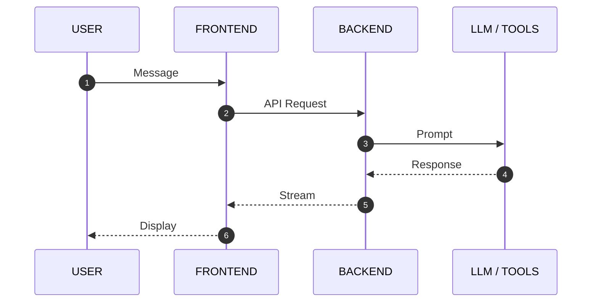

# Модуль 4: Архитектура реальных AI-сервисов

---

<grid drag="100 100" drop="center">
![[module_4_cover.png]]
</grid>

---

## Структура модуля

+ Frontend vs Backend: Разделение ответственности
+ Case Studies: Разбор реальных проектов
+ Architectural Tracing: Проектирование систем
+ Practice: Сборка MVP

---

## Блок 1: Frontend vs Backend в AI
### Почему мы разделяем логику?

---

<grid drag="45 60" drop="2 15" align="top">
<i class="fas fa-desktop fa-3x"></i>
 

### FRONTEND
+ Интерфейс: Chat UI, Стриминг
+ UX: Обработка событий
+ Клиент: Ввод данных
</grid>

<grid drag="45 60" drop="53 15" align="top">
<i class="fas fa-server fa-3x"></i>
 

### BACKEND
+ Оркестрация: LLM & Tools
+ Безопасность: API Keys
+ Память: БД & Контекст
</grid>

---

<grid drag="100 80" drop="0 20" style="zoom: 1.8;">

</grid>

---

## Блок 2: Разбор реальных кейсов
### Экосистема прикладных решений

---

<split left="1" right="2" gap="2">
<i class="fas fa-running fa-7x"></i>

## edusport.neuro.ee
</split>

---

<split left="1" right="2" gap="2">
<i class="fas fa-car-side fa-7x"></i>

## ruttu.ee
</split>

---

<split left="1" right="2" gap="2">
<i class="fas fa-microscope fa-7x"></i>

## ai.evc.ee
</split>

---

<split left="1" right="2" gap="2">
<i class="fas fa-file-invoice fa-7x"></i>

## dunven.neuro.ee
</split>

---

<split left="1" right="2" gap="2">
<i class="fas fa-database fa-7x"></i>

## dims.neuro.ee
</split>

---

## Architectural Tracing
### Как спроектировать свой сервис?

1. **Input**: Какие данные мы получаем? (Voice, Image, Text)
2. **Reasoning**: Сколько шагов нужно ИИ? (ReAct, Planning)
3. **Execution**: Какие инструменты вызвать? (Search, SQL, Python)
4. **Output**: В каком виде отдать результат? (JSON, Report, Plot)

---

## Практика: Проектирование MVP

**Задание**:
Выберите бизнес-задачу и нарисуйте схему взаимодействия:
+ `User` -> `Frontend` -> `Backend` -> `LLM` -> `Execution` -> `Result`

---

<grid drag="100 20" drop="0 10">
## Хранение данных: Client-Side
</grid>

<grid drag="100 70" drop="0 35">
+ LocalStorage / SessionStorage: Быстрое хранение строк (настройки, токены).
+ OPFS: Origin Private File System — быстрая файловая БД в браузере.

---

<grid drag="100 20" drop="0 10">
## Хранение в облаке (BaaS)
</grid>

<grid drag="45 60" drop="2 32" align="top">
<i class="fas fa-bolt fa-3x"></i>
 

### SUPABASE
+ Полноценный PostgreSQL база данных
</grid>

<grid drag="45 60" drop="53 32" align="top">
<i class="fas fa-cloud fa-3x"></i>
 

### CLOUDFLARE
+ D1: SQL-база
+ R2: Объектное хранилище
</grid>

---

<grid drag="100 20" drop="0 10">
## REST API & Deployment
</grid>

<grid drag="100 70" drop="0 32">
1. **Server-Side**: Разработка API на FastAPI (Python) или Express (Node.js).
2. **VPS (Virtual Private Server)**: Аренда своего сервера (Ubuntu) для полного контроля.
3. **Reverse Proxy**: Настройка Nginx для маршрутизации и SSL (HTTPS).
4. **DevOps**: Контейнеризация и автоматизация деплоя.
</grid>

---

## Итоги модуля

+ **Separation of Concerns**: Фронт для людей, Бэк для безопасности.
+ **Data-First**: Архитектура строится вокруг потоков данных.
+ **Persistence**: Правильный выбор между клиентским хранением и облачными БД.
+ **Agentic Patterns**: Реальный сервис — это всегда агентная логика.

---

## Ресурсы

- Репозиторий: [github.com/sekachev/agentic_ai](https://github.com/sekachev/agentic_ai)
