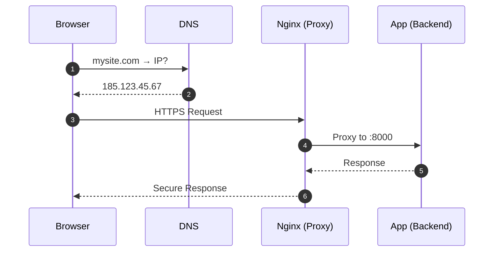
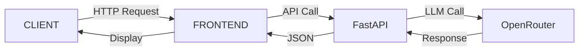

# Модуль 5: Deployment & DevOps 🚀

---

![[module_5_cover.png]]

---

## Структура модуля

+ <span style="color:orange">Ubuntu Terminal</span>: Шпаргалка по командам
+ <span style="color:orange">Сети</span>: IP, DNS и Nginx Proxy
+ <span style="color:orange">Frontend</span>: Деплой через Cockpit
+ <span style="color:orange">Backend</span>: FastAPI + Systemd

---

## Блок 1: Работа с терминалом

---

<grid drag="100 20" drop="0 10">
## 01. Шпаргалка по Ubuntu Terminal 
</grid>

<grid drag="100 70" drop="0 35">
+ <span style="color:orange">Навигация</span>: `ls`, `cd`, `pwd` — где я и что здесь?
+ <span style="color:orange">Файлы</span>: `cat`, `nano`, `mkdir`, `rm` — читаем и редактируем
+ <span style="color:orange">Процессы</span>: `systemctl`, `journalctl` — управление службами
+ <span style="color:orange">Хоткеи</span>: `Tab`, `Ctrl+R`, `Ctrl+C` — как профи

📖 **[Читать полный гайд](01_Шпаргалка%20по%20Ubuntu%20Terminal.md)**
</grid>

---

<grid drag="100 80" drop="0 20" style="zoom: 1.5;">
```bash
# Навигация
cd /var/www/html    # Перейти в папку
ls -lah             # Показать файлы (все + размеры)
pwd                 # Где я нахожусь?

# Системные службы
systemctl status nginx      # Проверить статус
journalctl -u myapp -f      # Смотреть логи в real-time
```
</grid>

---

## Блок 2: Сетевая инфраструктура


---

<grid drag="100 20" drop="0 10">
## 02. IP, DNS и Reverse Proxy
</grid>

<grid drag="100 70" drop="0 35">
+ <span style="color:orange">IP</span>: "Почтовый индекс" вашего сервера
+ <span style="color:orange">DNS</span>: Телефонная книга интернета (domain → IP)
+ <span style="color:orange">Nginx</span>: Швейцар — кто куда идёт
+ <span style="color:orange">SSL/HTTPS</span>: Безопасность через Certbot

📖 **[Читать подробное объяснение](02_IP,%20DNS%20и%20Проксирование.md)**
</grid>

---

<grid drag="100 80" drop="0 20" style="zoom: 1.6;">

</grid>

---

<split left="1" right="2" gap="2">
<i class="fas fa-lock fa-7x"></i>

## Nginx как швейцар

+ `mysite.com` → Frontend
+ `mysite.com/api` → Backend
+ Автоматический SSL

</split>

---

## Блок 3: Деплой Frontend
### От локальной сборки к продакшену

---

<grid drag="100 20" drop="0 10">
## 03. Деплой через Cockpit
</grid>

<grid drag="100 70" drop="0 35">
+ <span style="color:orange">Build</span>: `npm run build` — локально, на вашем компе
+ <span style="color:orange">Base URL</span>: Настройка `vite.config.js` для поддоменов
+ <span style="color:orange">Upload</span>: Cockpit Navigator → `/var/www/html`
+ <span style="color:orange">Verify</span>: Открываем и проверяем!

📖 **[Пошаговая инструкция](03_Деплой%20Frontend%20через%20Cockpit.md)**
</grid>

---

<grid drag="45 60" drop="2 25" align="top">
<i class="fas fa-laptop-code fa-3x"></i>
<br>

### ЛОКАЛЬНО
```bash
npm run build
```
Результат: папка `dist/`
</grid>

<grid drag="45 60" drop="53 25" align="top">
<i class="fas fa-cloud-upload-alt fa-3x"></i>
<br>

### НА СЕРВЕРЕ
Cockpit Navigator
```
/var/www/html/myapp/
```
</grid>

---

## Блок 4: Backend API
### FastAPI от теории до Systemd

---

<grid drag="100 20" drop="0 10">
## 04. FastAPI — от теории к практике
</grid>

<grid drag="100 70" drop="0 35">
+ <span style="color:orange">Теория</span>: Аналогия "Ресторан-Официант-Кухня"
+ <span style="color:orange">Почему FastAPI</span>: Скорость + типизация + автодокументация
+ <span style="color:orange">Swagger UI</span>: Интерактивная документация `/docs`
+ <span style="color:orange">Практика</span>: Реальный код + запуск
+ <span style="color:orange">Systemd</span>: Превращение скрипта в системную службу

📖 **[Полный туториал с примерами](04_FastAPI%20-%20от%20теории%20к%20практике.md)**
</grid>

---

<grid drag="100 80" drop="0 20" style="zoom: 1.8;">

</grid>

---

<split left="1" right="2" gap="2">
<i class="fas fa-utensils fa-7x"></i>

## Аналогия: Ресторан

+ **Frontend** = Меню
+ **Backend** = Официант
+ **LLM/Tools** = Кухня

</split>

---


```python
from fastapi import FastAPI

app = FastAPI()

@app.get("/")
def read_root():
    return {"message": "Hello World"}

@app.get("/ai/chat")
def chat(user_message: str):
    # Здесь вызов LLM
    return {"response": f"Вы сказали: {user_message}"}
```


---

## Блок 5: Превращаем в службу
### Systemd: запускаем API как профи

---

<grid drag="100 20" drop="0 10">
## Systemd: API работает 24/7
</grid>

<grid drag="100 70" drop="0 35">
+ <span style="color:orange">Установка</span>: `pip install fastapi uvicorn`
+ <span style="color:orange">Service File</span>: Создаём `/etc/systemd/system/myapp.service`
+ <span style="color:orange">Анатомия .service</span>: `[Unit]`, `[Service]`, `[Install]`
+ <span style="color:orange">Управление</span>: `systemctl start/stop/restart`
+ <span style="color:orange">Отладка</span>: `journalctl -u myapp -f`
</grid>

---

<grid drag="100 80" drop="0 20" style="zoom: 1.4;">
```ini
[Unit]
Description=FastAPI Application
After=network.target

[Service]
User=www-data
WorkingDirectory=/var/www/myapp
ExecStart=/usr/bin/uvicorn main:app --host 0.0.0.0 --port 8000
Restart=always

[Install]
WantedBy=multi-user.target
```
</grid>

---
### Жизненный цикл службы

```bash
# Включить службу
sudo systemctl enable myapp

# Запустить
sudo systemctl start myapp

# Проверить статус
sudo systemctl status myapp

# Смотреть логи
sudo journalctl -u myapp -f
```

---

## Практическое задание

**Задача**: Развернуть полноценный AI-сервис

1. ✅ **Frontend**: Vite App - создано Google AI studio
2. ✅ **Backend**: FastAPI - для хранения данных
3. ✅ **Nginx**: Один домен, два маршрута (`/` и `/api`)
4. ✅ **Systemd**: Backend работает как служба
5. ✅ **SSL**: HTTPS через Certbot

---

## Итоги блока

+ **Terminal** — ваш новый дом разработчика
+ **DNS + Nginx** — мост между доменом и кодом
+ **Cockpit** — быстрый деплой статики
+ **FastAPI** — современный backend за 10 минут
+ **Systemd** — ваш API работает всегда

---

## Ресурсы и материалы 📚

+ **01**: [Шпаргалка по Ubuntu Terminal](01_Шпаргалка%20по%20Ubuntu%20Terminal.md)
+ **02**: [IP, DNS и Проксирование](02_IP,%20DNS%20и%20Проксирование.md)
+ **03**: [Деплой Frontend через Cockpit](03_Деплой%20Frontend%20через%20Cockpit.md)
+ **04**: [FastAPI - от теории к практике (включая Systemd)](04_FastAPI%20-%20от%20теории%20к%20практике.md)

---

## Спасибо за внимание! 🚀


**Вопросы?**

Репозиторий: [github.com/sekachev/agentic_ai](https://github.com/sekachev/agentic_ai)
</grid>
