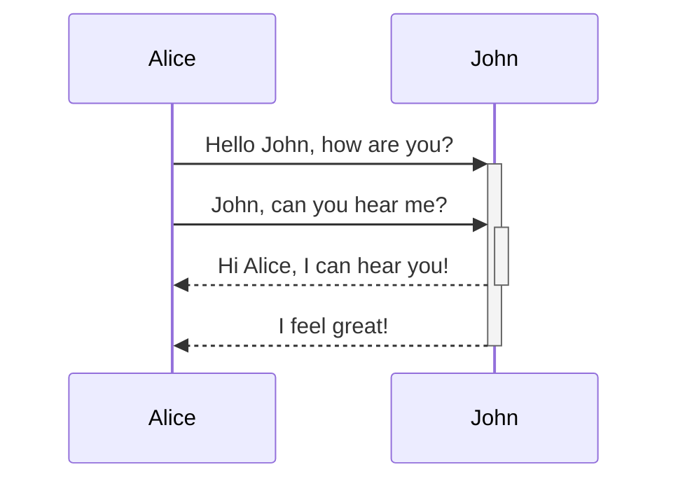
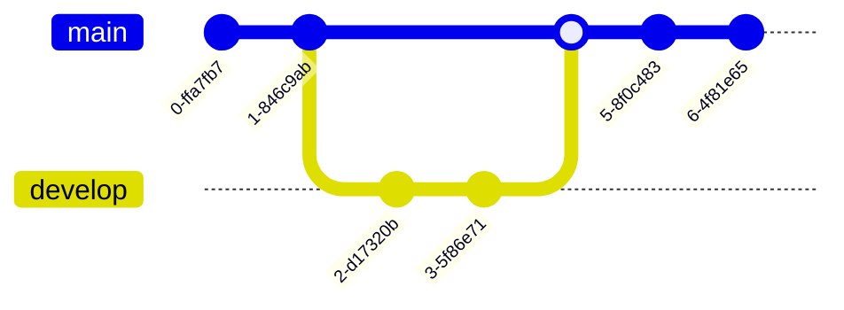

# Source: https://mszturc.github.io/obsidian-advanced-slides/basic-syntax/mermaid

```
---
theme: beige
highlightTheme: css/vs2015.css
---

```


```
---
theme: beige
highlightTheme: css/vs2015.css
---
#### Gitgraph Diagrams support

```


It’s possivle to overload the default mermaid configuration to change the behaviour / layout of the rendered mermaid diagrams. Do do this add a mermaid property to yaml as following:

mermaid: themeVariables: fontSize: 32px theme: ‘forest’

```
---
mermaid:
themeVariables:
fontSize: 32px
theme: 'forest'
---
```